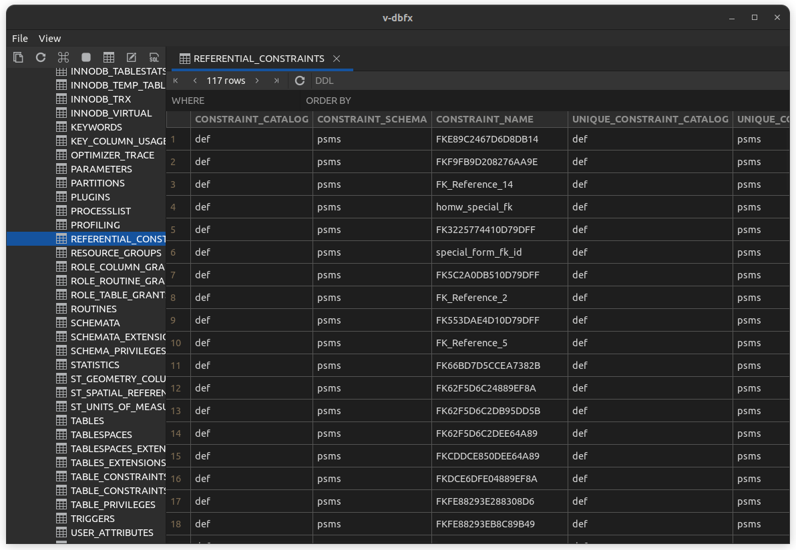

# v-dbfx

#### Description
**v-dbfx** A visual database management tool for Linux


#### Installation

```shell
    flatpak install cn.navclub.dbfx.flatpak 
```

### Snapshot
+ Program home


+ Program data view


